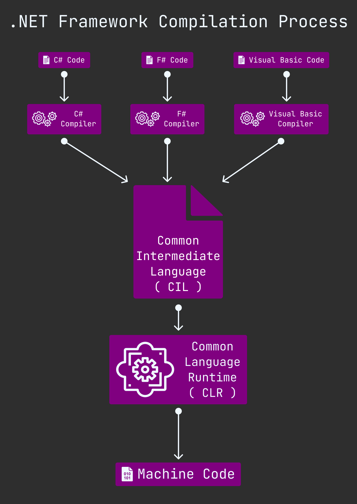

.NET Framework Compilation Process 
===================================

In .NET Framework compilation process first, compiler compile source code to **CIL (Common Intermediate Langauge)** or **MSIL (Microsoft Intermediate Languge)**. In that case, various type of compiler on it. If source code is C# then C# compiler work for convert it to CIL language. If source code is written with Visual Basic then Visual Basic compiler convert it. F# compiler work for F#, Visual C++ compiler for Visual C++ source code convert to CIL code. This CIL code save in **.DLL (Dynamic Link Library)** Then **CLR (Common Langugae Runtime)** work for convert CIL code to machine code. Here **JIT (Just In Time)** compiler compile the CIL code to machine code. Here simple diagram to understanding .NET framework compilation process : 

 

[Architecture of .NET](./../02.architecture_of_dotnet.md/01.architecture_of_dotnet.md) | [Procedural](./../section_01.md) | [Hello Word >](./../04.hello_world/04.hello_world.md)
--------------------------