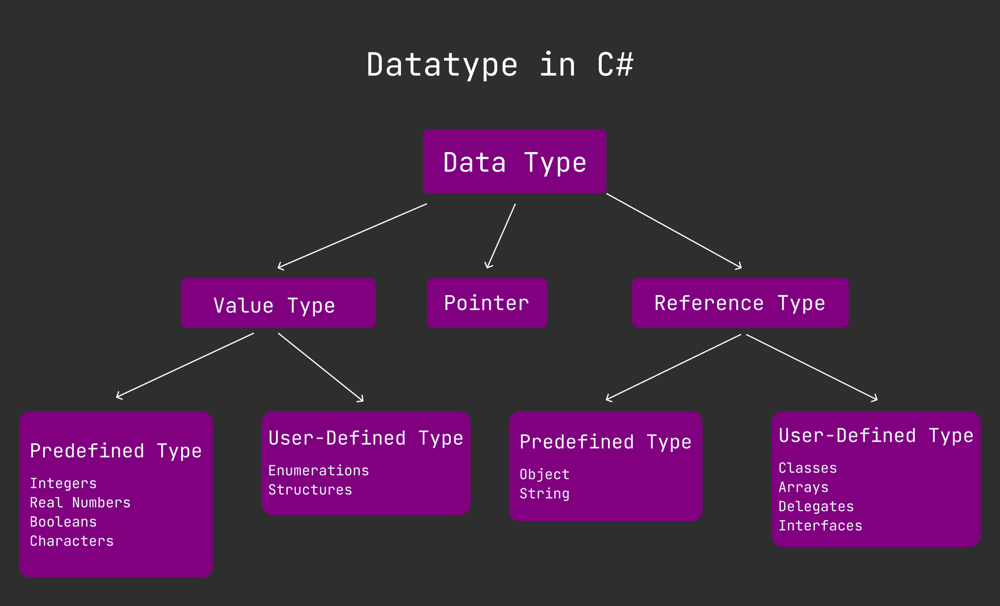

variable
========

Variable define syntax in C# is :

```cs
<datatype> variable_name = value; // declare and assinging variable
<datatype> variable; // declare variable
variable = value; // assinging value in variable
```

DataType 
========
Here the diagram of all c sharp data type : 



Here this part only explain value type : 

## Value type
Another name in value type is **premative** datatype. This is the basic type of c#. Here all premative data type : 

- Boolean Type (keyword : bool) (vlaue : true,false)
- Numeric Type
  - Integral Type (int)
    - Signed
      - Signed byte (keyword : sbyte)
      - Signed short (keyword : short)
      - Signed int (keyword : int)
      - Signed long (keyword : long)
    - Unsigned
      - Unsigned byte (keyword : byte)
      - Unsigned Short (keyword : ushort)
      - Unsigned int (keyword : uint)
      - Unsigned long (keyword : long)
  - Floating Type (keydowrd : flaot)
    - float (keyword : flaot) (must be append **f** or **F** in last position of number like 3.4f or 4.3F)
    - double (keyword : double) (as your wish append **d** or **D** in last position of number)
  - Decimal Type (keyword : decimal) (must be append **M** in last position.)
- Character Type

Example every data type in value : 

### Boolean
```cs
using System;

class ClassName{
    static void Main(){
        bool isOk = true;
        bool isUp = false; 

        Console.WriteLine($"isOk : {isOk}");
        Console.WriteLine($"isUp : {isUp}");
    }
}

/*
output : 
isOk : True
isUp : False
*/
```

### Signed Int
```cs
using System;

class ClassName{
    static void Main(){
        sbyte sbyteNumber = 3; // one byte (-128 to 127)
        short shortNumber = 454; // two byte (-32,768 to 32,767)
        
        int intNumber = 3432; // four byte (-2,147,483,648 to 2,147,483,647)
        long longNumber = 3452354; // eight byte (-9,223,372,036,854,775,807 to 9,223,372,036,854,775,807,807) 
        
        // below all defination is right
        // long longNumber = 3452354l; // it throw warning because l are 1 look like same
        // long longNumber = 3452354L;  

        Console.WriteLine($"sbyteNumber : {sbyteNumber}");
        Console.WriteLine($"shortNumber : {shortNumber}");
        Console.WriteLine($"intNumber : {intNumber}");
        Console.WriteLine($"longNumber : {longNumber}");


    }
}

/*
output : 
sbyteNumber : 3
shortNumber : 454
intNumber : 3432
longNumber : 3452354
*/
```

###  Unsigned Int

```cs
using System;

class ClassName{
    static void Main(){
        byte byteNumber = 33; // one byte (0 to 255)
        ushort ushortNumber = 343; // two byte (0 to 65,535)
        uint uintNumber = 354325642; // four byte (0 to 4,294,967,295)

        // append u in the last
        // uint uintNumber = 354325642U; // four byte (0 to 4,294,967,295)
        // uint uintNumber = 354325642u; // four byte (0 to 4,294,967,295)
        
        
        ulong ulongNumber = 39044563456; // eight byte (0 to 18,446,744,073,709,551,615)
        
        // append UL or ul in the last
        // ulong ulongNumber = 39044563456UL; 
        // ulong ulongNumber = 39044563456ul; 

        Console.WriteLine($"byteNumber : {byteNumber}");
        Console.WriteLine($"ushortNumber : {ushortNumber}");
        Console.WriteLine($"uintNumber : {uintNumber}");
        Console.WriteLine($"ulongNumber : {ulongNumber}");


    }
}

/*
output : 
ushortNumber : 343
uintNumber : 354325642
ulongNumber : 39044563456
*/
```

### Floating Point

```cs
using System;

class ClassName{
    static void Main(){
        // float must be append f or F
        float floatNumber = 343.33f; // 4 bytes (1.5x10^-45 to 3.4x10^35)
        // float floatNumber = 343.33F; // same as above just use F

        // use d or D is optional at last position
        double doubleNumber = 343.33; // 8 bytes (5.0x10^-324 to 1.7^308)
        // double doubleNumber = 343.33d;
        // double doubleNumber = 343.33D;


        // mantissa e exponent
        float efloatNumber = 3.4e3f;
        double edoubleNumber = 4.5e-4;

        Console.WriteLine($"floatNumber : {floatNumber}");
        Console.WriteLine($"doubleNumber : {doubleNumber}");
        Console.WriteLine($"efloatNumber : {efloatNumber}");
        Console.WriteLine($"edoubleNumebr : {edoubleNumber}");
    }
}

/*
output : 
floatNumber : 343.33
doubleNumber : 343.33
efloatNumber : 3400
edoubleNumebr : 0.00045
*/
```

### Decimal

```cs
using System;

class ClassName{
    static void Main(){
        // use m or M at last position, required
        decimal decimalNumber = 3432.3M;
        decimal edecimalNumber = 343.34e2m; // mantiss e exponent

        Console.WriteLine($"decimalNumber : {decimalNumber}");
        Console.WriteLine($"edecimalNumber : {edecimalNumber}");
    }
}

/*
output : 
decimalNumber : 3432.3
edecimalNumber : 34334
*/
```

### Character

```cs
using System;

class ClassName{
    static void Main(){
        char grade = 'a'; // define character type with single quote.
        
        Console.WriteLine($"grade : {grade}");
        
        /*
        below all thing are wrong : 
        grade = "a";
        grade = '435';
        */
    }
}

/*
output : 
grade : a
*/
```