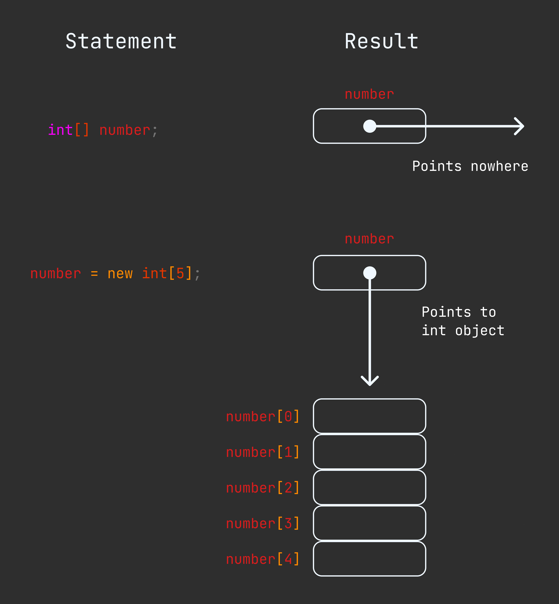

Array
-----
This chapter contain : 

## Creating Array
Creation of an array involves three steps. Here : 
1. Declaring Array.
2. Creating Memory locations.
3. Putting Value into the memory location.

### Declaring Array
The syntax of declaring array is : 
```cs
<data_type>[] arrayName;
```

Example : 
```cs
int[] counter;
```

### Creating Memory Locations
The syntax of creating memory location syntax : 
```cs
arrayName = new <data_type>[size];
```

Example : 
```cs
number = new int[5];
average = new float[10];
```

Below diagram Example : 



### Putting value into the memory location
The final step is to put values into the array created. This process is known as initialization. This is done using the array subscripts(other language known as index). Syntax : 

```cs
arrayName[subscript] = value;
```

Example : 
```cs
numebr[0] = 35;
number[1] = 40;
.......
.......
number[4] = 19;
```

It possible to creating array and initializtion at same time : 
```cs
<dataType> [] arrayName = new <dataType>[size]{value,value,value};
<dataType> [] arrayName = new <dataType>[]{value,value,value}; // Length will be three
<dataType> [] arrayName = {value,value,value}; // array literals
```

Example : 
```cs
using System;

class ArrayClass{
    static void displayArray(int[] array,int length){
        int i;
        Console.Write($"{array}({length}){{");
        for(i = 0;i < length-1;i++){
            Console.Write($"{array[i]},");
        }

        Console.WriteLine($"{array[i]}}}");
    }

    static void Main(){
        // creating array
        int[] array; // it point nowhere
        array = new int[4]; // allocate memory locations

        // initialization of array
        array[0] = 32;
        array[1] = 123;
        array[2] = 343;
        array[3] = 343;
        Console.WriteLine(array);
        displayArray(array,4);

        // creating and declaring at time
        int[] intArray = new int[2];
        displayArray(intArray,intArray.Length);

        // createing, declaring and initializing at a time
        int []intArrayThree = new int[3]{3,4,5};
        displayArray(intArrayThree,intArrayThree.Length);

        int []intArrayFour = new int[]{19,7,8};
        displayArray(intArrayFour,intArrayFour.Length);

        // more shortcut
        int []intArrayFive = {1,1,1,1};
        displayArray(intArrayFive,intArrayFive.Length);

        
        // below thing is wrong
        /*
        int []arr = new int[3]{34,343,3}; // error
        int []arr = new int[3]{3,3}; // error
        */
    }
}

/*
output : 
System.Int32[]
System.Int32[](4){32,123,343,343}
System.Int32[](2){0,0}
System.Int32[](3){3,4,5}
System.Int32[](3){19,7,8}
System.Int32[](4){1,1,1,1}
*/
```

## Array Length 
Every array has a member called Length. Which is use for get array Length. 
```cs
int n = arranName.Length; // get array length
```

## Two Dimensional Array
Creating two dimentional array like : 
```cs
<data_type>[,] twoDimentionalArrayName; // declaration
twoDimentionalArrayName = new <data_type>[row_size,col_size]; // creating location
```

Exmaple : 
```cs
int [,] arr ;
arr = new int[2,4];
// declaration and initilization
int [,] arr0 = new in[3,4];
```

It possible to declare and initialize array at time. Example : 
```cs
int [,] tableOne = new int[2,2]{{3,4},{4,3}}
int [,] tableTwo = {{3434,343,3},{3,3,2}};
```

Accessing two dimentional array : 
```cs
arrayName[rowNum,colNum];
```

```cs
using System;

class TwoDimentionalArray{
    static void showTable(int [,] table,int row,int col){
        Console.WriteLine($"{table} : ");
        int rowTrack,colTrack ;

        for(rowTrack = 0;rowTrack < row; rowTrack++){
            Console.Write("{");
            for(colTrack = 0;colTrack < (col - 1);colTrack++){
                Console.Write($"{table[rowTrack,colTrack]},");
            }

            Console.WriteLine(($"{table[rowTrack,colTrack]}}}"));
        }
    }

    static void Main(){
        // create two dimentional array
        int [,] tableOne = new int[2,2];

        // initialize 
        tableOne[0,0] = 99;
        tableOne[1,1] = 33;

        showTable(tableOne,2,2);

        // initialize and declare at a time
        int [,] tableTwo = new int[3,3]{
            {3,4,2},
            {2,2,3},
            {3,5,4}
        };

        showTable(tableTwo,3,3);

        // another way
        int [,] tableThree = {
            {3,3},
            {32,11},
            {2,2}
        };

        showTable(tableThree,3,2);
    }
}

/*
output : 
System.Int32[,] : 
{99,0}
{0,33}
System.Int32[,] : 
{3,4,2}
{2,2,3}
{3,5,4}
System.Int32[,] : 
{3,3}
{32,11}
{2,2}
*/
```
## Variable Size Array (Jagged Array)
It possible two dimentional array as follow as :
```cs
int [][] x = new int[3][]; // three rows of array;
x[0] = new int[2]; // first row has two elements
x[1] = new int[4]; // second row has four elements
x[2] = new int[3]; // third row has three elements
```

Example of jagged array : 
```cs
using System;

class JaggedArray{
    static void printArray(int[][] table){
        int row = table.Length;
        int rowTrack,colTrack;

        Console.WriteLine(table);
        for(rowTrack = 0;rowTrack < row;rowTrack++){
            Console.Write("{");
            for(colTrack = 0;colTrack < table[rowTrack].Length - 1; colTrack++){
                Console.Write($"{table[rowTrack][colTrack]},");
            }
            Console.WriteLine($"{table[rowTrack][colTrack]}}}");
        }
    }

    static void Main(){
        // create jagged array
        int [][] table = new int[3][];
        table[0] = new int[]{3,4,5};
        table[1] = new int[]{3,4,5,5};
        table[2] = new int[]{4,3,2};

        printArray(table);


    }
}
```
## The System.Array Class

## ArrayList Calss
